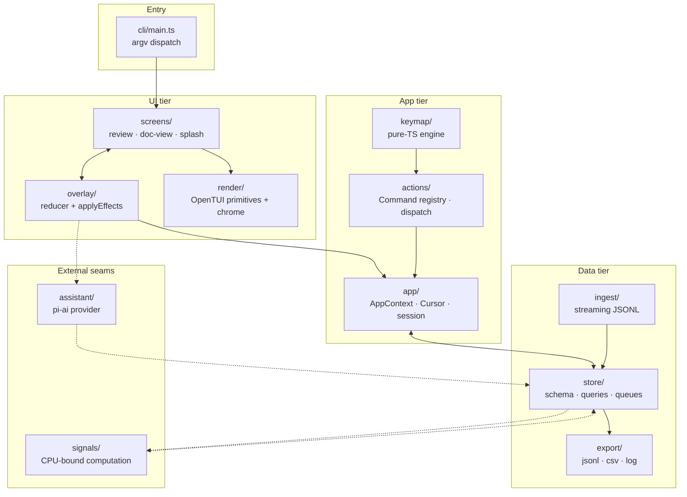
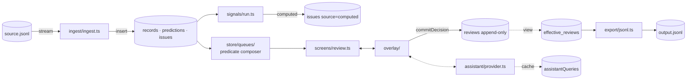
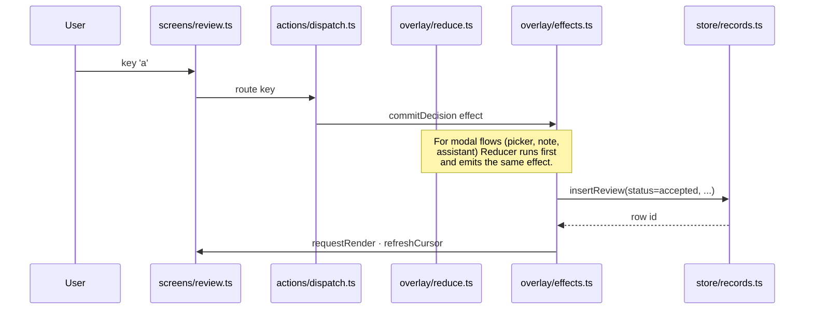
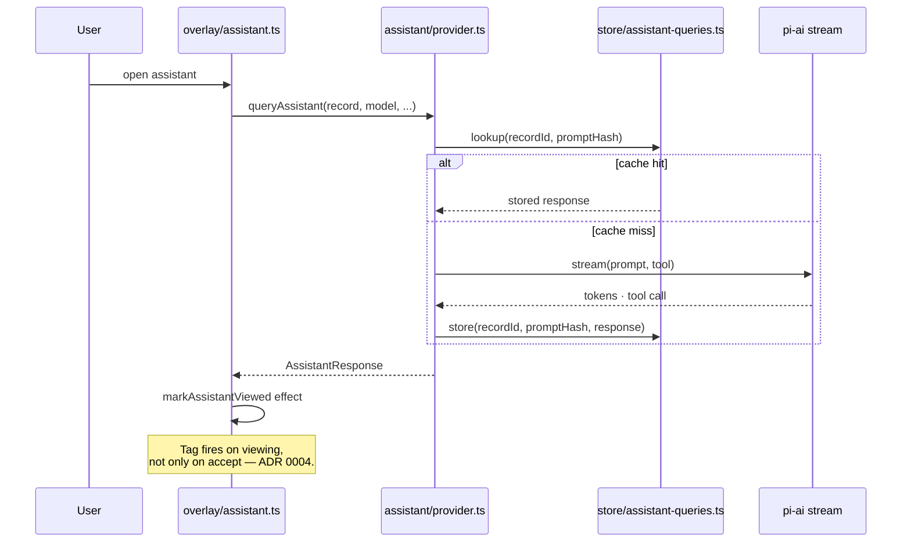
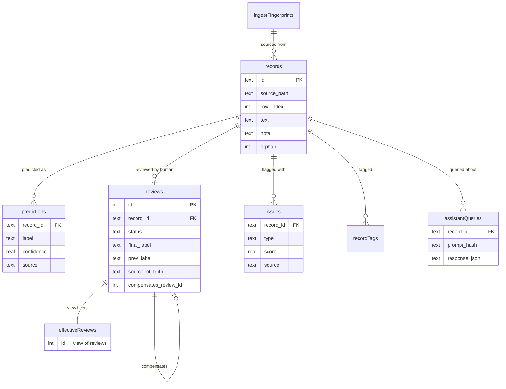

# Architecture

LabelLens is a terminal-first review tool. Source data is JSONL on disk; review state lives in a sidecar SQLite database. Between them is one Bun process that ingests records, computes prioritization signals, renders a TUI, and (optionally) calls an LLM assistant.

This page is the map. It tells you what each layer does, how a record flows through, and which decisions are load-bearing. Every claim that re-states an ADR or the PRD links there instead of duplicating.

For the user-facing reference (config, keybindings, queues, CLI flags), see [docs/reference/](../reference/). For the "why" behind individual design choices, see [docs/adr/](../adr/) and the sibling [explanation pages](./).

## At a glance

Stack: Bun + TypeScript, OpenTUI (imperative core), `bun:sqlite` + `drizzle-orm/bun-sqlite`, [`@earendil-works/pi-ai`](https://github.com/earendil-works/pi-ai) for the assistant, TypeBox for config and tool schemas. The keymap engine is pure TS with no UI deps so it stays deterministic and unit-testable. See [PRD §16](../../PRD.md) for the layering rationale.

## Module layout

| Subdir | Role |
|---|---|
| [`src/cli/`](../../src/cli/) | `main.ts` parses argv; `run.ts` is the review-loop bootstrap; `init.ts`, `export.ts`, `migrate.ts` handle the other subcommands. |
| [`src/store/`](../../src/store/) | Drizzle schema ([`schema.ts`](../../src/store/schema.ts)), open/migrate logic, query helpers, per-queue predicates ([`queues/`](../../src/store/queues/)). |
| [`src/config/`](../../src/config/) | TypeBox `LabellensConfigSchema`. Editing this is what regenerates `schema/labellens.config.schema.json` via `bun run schema`. |
| [`src/actions/`](../../src/actions/) | Command registry + keypress dispatcher. Every reviewer-visible action — accept, reject, undo, switch queue, open palette — is one Command. |
| [`src/overlay/`](../../src/overlay/) | Modal sub-surfaces. Pure `reduce*` functions per overlay, one `applyEffects` interpreter. The seam. |
| [`src/render/`](../../src/render/) | Thin OpenTUI wrappers (box, text, input, select, scrollbox, markdown) + composite chrome (`sidebar`, `status-bar`, `action-footer`). See [ADR 0010](../adr/0010-render-primitives-vs-composites.md). |
| [`src/screens/`](../../src/screens/) | Top-level view assemblies: review loop, doc view, splash, reingest prompt. |
| [`src/assistant/`](../../src/assistant/) | `queryAssistant` entrypoint, prompt template, tool schema, model resolver. |
| [`src/signals/`](../../src/signals/) | CPU-bound work: low-confidence, source-disagreement, exact-duplicate computation. |
| [`src/ingest/`](../../src/ingest/) | Streaming JSONL reader, content-hash IDs, smart-reingest diff. |
| [`src/export/`](../../src/export/) | JSONL, CSV, audit-log writers. |
| [`src/app/`](../../src/app/) | `AppContext` — the shared state object that ties cursors, config, db handle, motion, flash, overlay, and counters together. |
| [`src/cursor/`](../../src/cursor/), [`src/keymap/`](../../src/keymap/), [`src/picker/`](../../src/picker/), [`src/boundary/`](../../src/boundary/), [`src/man/`](../../src/man/) | Smaller focused subsystems — cursor abstraction, keymap engine, relabel palette filter, document boundary resolution, in-app man page. |

The "Where things live" table in [CLAUDE.md](../../CLAUDE.md) covers the same ground at the file-pointer level — use it for fast lookups; use this page when you need the shape.

## Data flow: a record's lifecycle

Six stages, each with a single owning module.

### 1. Ingest

[`src/ingest/ingest.ts`](../../src/ingest/ingest.ts) streams the source JSONL via `Bun.file().stream()` — the full file never lands in memory. Each line becomes a row in `records` plus zero-or-more rows in `predictions` and `issues`. Record IDs are content-hash IDs by default ([ADR 0001](../adr/0001-content-hash-identity.md)): SHA-256 over normalized `text + context_before + context_after`, unless the JSONL provides an explicit `id`.

Re-ingest is smart-diff, not destructive: [`src/ingest/reingest.ts`](../../src/ingest/reingest.ts) compares fingerprints, distinguishes prediction-only changes from structural changes, and marks affected records as `orphan` so prior reviews aren't silently invalidated ([ADR 0002](../adr/0002-smart-reingest.md)).

### 2. Signals

Prioritization signals are computed at startup once ingest is settled. [`src/signals/run.ts`](../../src/signals/run.ts) walks every record, computes `low_confidence`, `source_disagreement`, and `exact_duplicate` scores, and writes them to `issues` with `source = 'computed'`. Imported `issues` rows survive — only computed rows are purged and re-emitted.

The convention is that heavy CPU work runs in a Bun Worker so the main thread stays responsive (see CLAUDE.md). The worker entrypoint exists at [`src/signals/worker.ts`](../../src/signals/worker.ts); the production path currently calls `runSignals` inline from `cli/run.ts` because the loop is short enough that backgrounding it isn't yet a win. The shape is in place for when it is.

### 3. Queue resolution

A queue is a saved predicate. Built-ins (`pending`, `low-confidence`, `disagreements`, `skipped`, `orphans`, ...) plus parametric factories (`by-source:llm:gpt-4`, `by-label:food`) plus user-written `where:` expressions all compile to the same shape: a Drizzle `SQL` fragment.

The composition lives in [`src/store/queues/`](../../src/store/queues/):

- [`predicates.ts`](../../src/store/queues/predicates.ts) — reusable building blocks (`unreviewed()`, `nonOrphan()`, `latestEffectiveStatus(...)`).
- [`registry.ts`](../../src/store/queues/registry.ts) — registers every queue type, including the resolver for parametric ones.
- [`predicate.ts`](../../src/store/queues/predicate.ts) + [`store/where-parser.ts`](../../src/store/where-parser.ts) — the `where:` DSL tokenizer and compiler. `where:` queries exclude orphans by default ([ADR 0012](../adr/0012-where-dsl-excludes-orphans-by-default.md)).

Every status predicate runs through `effective_reviews`, not raw `reviews`. The `where:status = accepted` example resolves to a subquery that picks the latest effective row, then compares its status. There is no path that re-derives "non-undone, non-compensated" inline ([ADR 0007](../adr/0007-effective-review-entry.md)).

### 4. Review action

A keypress in the review loop becomes a Command, which becomes (usually) an Overlay event, which becomes one or more Effects, which become DB writes.

The split is load-bearing: every reducer is a pure function from `(state, event) → { overlay?, effects[] }`. Only [`applyEffects`](../../src/overlay/effects.ts) touches the database, the cursor cache, or any other AppContext mutable state. New modal flows go through this seam; bespoke key handlers on screens are an anti-pattern ([ADR 0013](../adr/0013-overlay-key-propagation.md)).

`reviews` is append-only. Undo writes a compensating row with `compensates_review_id` pointing at the original. The `effective_reviews` SQL view filters undone and compensated rows; current-state reads use the view ([ADR 0007](../adr/0007-effective-review-entry.md), [effective-review explainer](./effective-review.md)).

### 5. Assistant call

When the reviewer opens the assistant panel, [`queryAssistant`](../../src/assistant/provider.ts) builds the prompt, hashes it (with provider + model + template version), and either pulls a cached response from `assistantQueries` or streams a fresh one via pi-ai.

The tool schema constrains the model's output to the configured label set; an unknown label can't come back. The `markAssistantViewed` effect runs regardless of whether the reviewer ultimately accepts the suggestion, which is why a downstream commit can flag `source_of_truth = 'human+assistant'` ([ADR 0004](../adr/0004-source-of-truth-includes-viewing.md), [assistant-audit explainer](./assistant-audit.md)).

### 6. Export

`labellens export jsonl` (or `csv`, or `log`) reads from the same DB. [`src/export/jsonl.ts`](../../src/export/jsonl.ts) selects records by queue predicate, then calls [`latestEffectiveByRecord`](../../src/store/queries.ts) once to pull the current effective review for every record in a single query rather than N round-trips. The audit log export ([`src/export/log.ts`](../../src/export/log.ts)) is the one surface that intentionally reads raw `reviews` — undone and compensated rows belong in an audit trail.

## Store schema

`effective_reviews` is the only view that other code is allowed to depend on for current state. The schema is in [`src/store/schema.ts`](../../src/store/schema.ts); migrations live under [`migration/`](../../migration/) and are bundled into the compiled binary via Bun `--define` ([ADR 0005](../adr/0005-drizzle-orm-with-bundled-migrations.md)).

## Key seams and invariants

These are the rules a contributor needs to know before changing anything load-bearing. Most have a one-page explainer or an ADR; this section is the index, not the substance.

- **`effective_reviews` is the only source of truth for current state.** Never re-derive the "non-undone, non-compensated" predicate inline. Audit surfaces (history strip, `export log`) are the explicit exceptions. → [ADR 0007](../adr/0007-effective-review-entry.md), [effective-review](./effective-review.md).
- **Modal flows go through the overlay seam.** Pure `reduce*` per overlay, one `applyEffects` interpreter. Reducers stay pure; only `applyEffects` mutates. → [ADR 0013](../adr/0013-overlay-key-propagation.md), [`src/overlay/`](../../src/overlay/).
- **Render primitives vs composites.** Thin wrappers around OpenTUI (`box`, `text`, `input`, `select`, `scrollbox`, `markdown`) are the only place OpenTUI types leak in. Composites can couple to domain types freely. → [ADR 0010](../adr/0010-render-primitives-vs-composites.md).
- **Chrome system.** Status bar + action footer are uniform across every screen; `CHROME_ROW_OVERHEAD = 3` is the layout contract. → [ADR 0008](../adr/0008-chrome-system.md).
- **Source data is immutable.** Nothing writes back to the user's JSONL. All state lives in `.labellens/state.db`.
- **Source-of-truth = `human+assistant` on viewing.** Opening the panel counts as influence, not only accepting the suggestion. → [ADR 0004](../adr/0004-source-of-truth-includes-viewing.md), [assistant-audit](./assistant-audit.md).
- **Skipped is its own state, not a flavor of pending.** Five mutually exclusive review states with their own queues and counters. → [ADR 0003](../adr/0003-skipped-distinct-state.md), [skipped-state](./skipped-state.md).
- **Content-hash identity.** Same line in two different documents stays distinct because context joins into the hash. Hand-rolled IDs in the source override. → [ADR 0001](../adr/0001-content-hash-identity.md).
- **Cursor stays on AppContext.** Tempting to extract a `CursorRegistry`; resist. → [ADR 0011](../adr/0011-cursor-not-a-deepening-target.md).
- **`where:` excludes orphans by default.** Opt in with the `include-orphans:` prefix. → [ADR 0012](../adr/0012-where-dsl-excludes-orphans-by-default.md).
- **Pure-TS deps only besides `bun:sqlite`.** Keeps the compiled binary native-module-free.
- **Heavy CPU is meant to run off the main thread.** Worker scaffolding exists in [`src/signals/worker.ts`](../../src/signals/worker.ts); current usage is short enough to stay inline.

## Decision map

| Subsystem | Governing ADRs |
|---|---|
| Store | [0001](../adr/0001-content-hash-identity.md), [0002](../adr/0002-smart-reingest.md), [0005](../adr/0005-drizzle-orm-with-bundled-migrations.md), [0007](../adr/0007-effective-review-entry.md), [0012](../adr/0012-where-dsl-excludes-orphans-by-default.md) |
| Overlay | [0013](../adr/0013-overlay-key-propagation.md) |
| Assistant | [0004](../adr/0004-source-of-truth-includes-viewing.md), [0009](../adr/0009-assistant-inline-footer.md) |
| Render | [0008](../adr/0008-chrome-system.md), [0010](../adr/0010-render-primitives-vs-composites.md) |
| App lifecycle | [0003](../adr/0003-skipped-distinct-state.md), [0011](../adr/0011-cursor-not-a-deepening-target.md) |
| Packaging | [0006](../adr/0006-no-darwin-x64-prebuilt.md) (superseded) |

## Where to go next

- [`PRD.md`](../../PRD.md) — full behaviour spec.
- [`CONTEXT.md`](../../CONTEXT.md) — domain glossary, including the `Avoid` rules that this codebase enforces in code review.
- [`docs/adr/`](../adr/) — every load-bearing decision, with context.
- [`docs/reference/`](../reference/) — config schema, keybindings, queue grammar, CLI flags, output schemas.
- [`CONTRIBUTING.md`](../../CONTRIBUTING.md) — dev loop, worktree workflow, testing, commit conventions.
